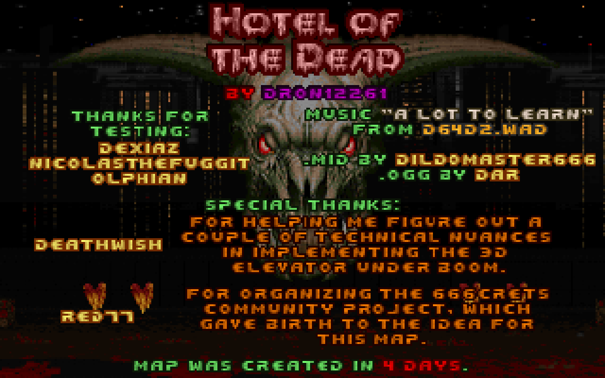
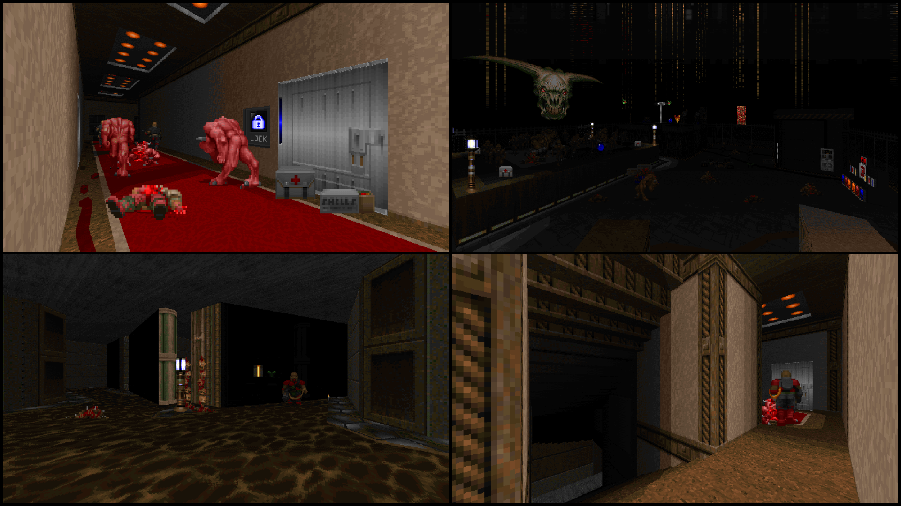
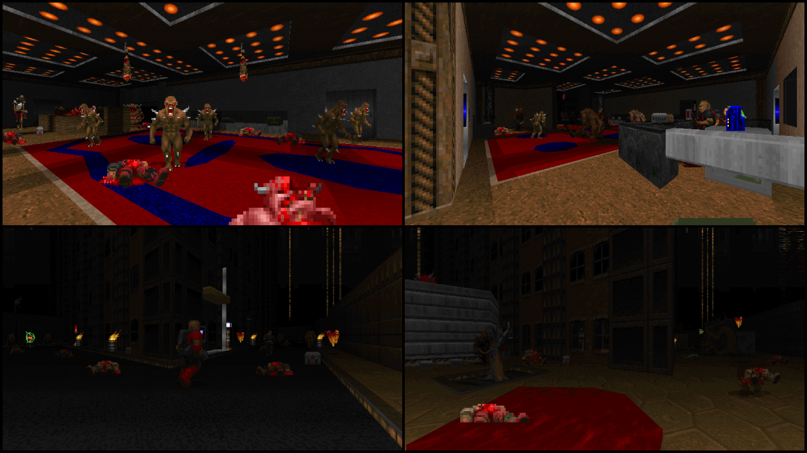

# Hotel of the Dead [1 Level, BOOM, DOOM 2]

# STATUS: ✅RELEASED

## Resources in use:
- [jimmytex.wad](https://drive.google.com/file/d/1r77r_FHEuyTESY0BbZEmRXvS3ITYOTxC/view?usp=share_link)
- [32in24-15-tex_v2.wad](https://esselfortium.net/wasd/32in24-15_tex_v2.zip) (only SKY)
- Thunder sounds from Eternity Engine resources
- Music from [D64D2.wad](https://www.doomworld.com/idgames/levels/doom2/megawads/d64d2) by DILDOMASTER666 and [ogg cover](https://youtu.be/mcxGNVcEySs) by DAR.

My single-player map in Boom format called "Hotel of the Dead".

### Download - [Latest Release](https://github.com/Doom-Mapping-Modding-Lair-DRON12261/WAD-Hotel-of-the-Dead/releases/latest/download/HOTDv4.zip)

Initially the first version was created in 3 days for the community project "666crets", organized by RED77. Later, after another extra day of revisions, the current version was ready for separate distribution as a standalone .wad file, not tied to the framework of the community project. It should take up to 20 minutes for Ultra-Violence.

Should run on any relatively new (as of January 28, 2023) Boom-compatible port. For the best gaming experience, I recommend using Doom Retro, Eternity Engine, Woof! or ZDoom 2.8.1. The level is designed for NoJump and Software render (or something successfully emulated and similar).

Provided for all three levels of difficulty, there is a layout of actors for cooperative mode (but testing is almost not held), as well as a separate layout for Deathmatch mode.

Special thanks for testing:
- Dexiaz
- NicolasTheFuggit
- Olphian

Special thanks to DeathWish, for helping me figure out a couple of technical nuances in implementing the 3D elevator under Boom (the one on the street leads to the second floor).

Special thanks to RED77, for organizing the "666crets" community project, which gave birth to the idea for this map.

The music was taken from D64D2.wad(MAP29) by DILDOMASTER666 (midi version). Also in the ports supporting UMAPINFO, EMAPINFO, ZMAPINFO plays the ogg cover of the track which author is DAR.

List of tested ports:
- DSDA - [0.25.6];
- Woof! - [10.4.0];
- prBoom+ - [2.6.1];
- Eternity Engine - [4.02];
- Doom Retro - [4.7.2];
- GZDoom - [4.9.0];
- Zandronum - [3.1];
- LZDoom - [3.88];
- ZDoom - [2.8.1];
- ZDaemon - [1.10.22];
- Odamex - [10.3];
- Crispy Doom - [5.12.0] (without intermission texts).

Screenshots:

Additional links:
- [DoomWorld Topic](https://www.doomworld.com/forum/topic/133699-boom-doom2-hotel-of-the-dead-by-dron12261-1-level/)
- [IDDQD.ru Topic](http://i.iddqd.ru/viewtopic.php?t=2303&sid=b0a25f7a6cbffdacfdb6efbed742a62e)
